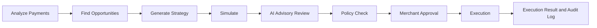
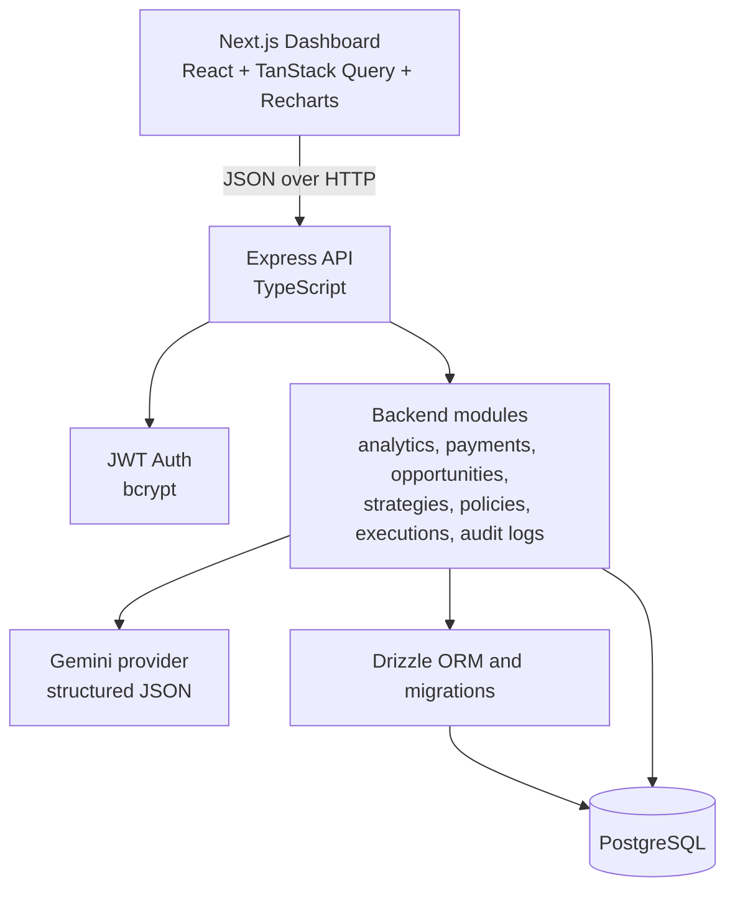

# PAYLAB

**A governed payment-recovery workspace that turns failed-payment evidence into simulated, reviewable recovery strategies.**

PAYLAB is an MVP for analyzing a merchant's payment history, finding repeatable failure patterns, proposing a recovery strategy, and requiring simulation, AI review, deterministic policy checks, and merchant approval before a simulated execution is recorded.

> **Scope:** PAYLAB currently works with seeded or application-managed payment data. Its execution flow is simulated and does not initiate real payment operations.

## What is PAYLAB?

Payment failures are not always random. They can cluster around a payment method, device type, time window, or customer retry behavior. Without analysis, a merchant may see only aggregate failed payments and miss revenue that could potentially be recovered.

PAYLAB provides a controlled workflow:

1. Analyze payment and retry history.
2. Detect evidence-backed recovery opportunities.
3. Generate a structured strategy for an opportunity.
4. Project the strategy's impact with a deterministic simulation.
5. Ask an AI advisory agent to review risks and assumptions.
6. Enforce merchant-configured safety rules.
7. Require explicit merchant approval.
8. Record a simulated execution and result.

## Why PAYLAB?

The system focuses on **recoverable payment failures** rather than treating every failed transaction equally. It compares observed behavior against a baseline, preserves the evidence used to create an opportunity, and keeps AI recommendations behind deterministic controls and human approval.

This makes the proposed action inspectable: a reviewer can see the affected transactions, estimated value, assumptions, risk assessment, policy result, approval, execution record, and audit events in one place.

## Core workflow



The backend enforces the order of the safety-critical steps. A strategy cannot be approved until it has a completed simulation, an advisory review, and a passed policy result. Execution requires merchant approval and creates a simulated result.

## Key features

- Merchant-scoped payment analytics and payment-attempt history.
- Deterministic opportunity detection for:
  - UPI failures during the 19:00–22:00 window.
  - Mobile card failures compared with non-mobile card failures.
  - Customers with repeated failures or retries.
- Structured Gemini-powered strategy generation with Zod validation.
- Deterministic recovery simulation with explicit assumptions and confidence.
- Gemini advisory review that returns a decision, confidence, concerns, recommendations, assumption issues, and risk level.
- Configurable deterministic policy checks for exposure, affected transaction share, payment methods, execution hours, amount, and confidence.
- Explicit merchant approval before execution.
- Simulated execution results with expected versus actual simulated recovery.
- JWT authentication, bcrypt password hashing, request logging, rate limits, Helmet, CORS, validation, and audit logs.
- Next.js dashboard pages for analytics, payments, opportunities, strategy review, approval, and execution history.

## How the system works

### 1. Analyze payments

The API reads merchant-scoped `payments` and `payment_attempts` records. Analytics can be viewed as an overview, by payment method, by failure dimension, or as time-based trends. Supported dimensions include payment method, hour, date, and device metadata.

### 2. Find opportunities

`POST /api/opportunities/analyze` runs the current rule-based detector. Each opportunity stores its type, severity, priority, affected count, affected payment value, estimated opportunity value, confidence, and evidence.

Existing active opportunities of the same type are not duplicated. The detector uses minimum sample and lift thresholds so an isolated failure is not promoted as an opportunity.

### 3. Generate a strategy

`POST /api/opportunities/:id/generate-strategy` sends the opportunity evidence, merchant context, and historical evidence to Gemini. The response must match a strict structured schema containing an objective, target segment, trigger, actions, expected impact, assumptions, risks, confidence, and reasoning.

The generated configuration is stored in `strategies`, with a version number and a strategy type derived from the opportunity type.

### 4. Simulate

`POST /api/strategies/:id/simulate` creates one simulation for a strategy. It calculates current success rate and revenue from the merchant's payment history, then applies a sampled recovery-rate assumption only to the opportunity's affected transactions and payment value.

The simulation records projected success rate, projected revenue, potential revenue recovery, confidence, assumptions, and risk level. It does not change payment records.

### 5. AI advisory review

`POST /api/strategies/:id/advisory-review` sends the strategy, simulation output, opportunity, and opportunity evidence to Gemini. The response is normalized and validated before being persisted as an advisory review.

The advisory agent is consultative. Its system prompt explicitly prevents it from authorizing execution. A response of `APPROVE`, `MODIFY`, or `REJECT` becomes an advisory recommendation and risk assessment; it is not a substitute for policy enforcement or merchant approval.

### 6. Policy check

`POST /api/strategies/:id/policy-check` evaluates the latest completed simulation and advisory review against the active merchant policy. The default policy includes:

| Rule | Default |
|---|---:|
| Maximum affected transaction percentage | 10% |
| Maximum revenue exposure percentage | 25% |
| Allowed payment methods | UPI, card, net banking |
| Allowed execution hours | 00:00–23:00 |
| Maximum daily execution amount | `100000.0000` |
| Minimum strategy confidence | 60 |
| Minimum simulation confidence | 60 |

The result stores evaluated values and failed rules. A passed check moves the strategy to `policy_approved`; a failed check moves it to `failed`. A strategy also requires an approved advisory recommendation.

### 7. Merchant approval

`POST /api/strategies/:id/approve` is available only after policy approval. The backend verifies the strategy state, completed simulation, advisory review, and passed policy result before recording the approving user and moving the strategy to `merchant_approved`.

### 8. Execution

`POST /api/strategies/:id/execute` creates an execution and immediately records a completed simulated result. The current implementation:

- does not call Razorpay or another payment provider;
- does not retry, refund, or mutate real payment state;
- stores `simulated: true` in audit metadata and execution details;
- calculates actual simulated recovery as 90% of the expected recovery.

Execution and result records are visible through the executions API and dashboard.

## System architecture



### Major backend modules

- `auth` — registration, login, current-user lookup, access tokens.
- `merchants` — merchant profile and merchant context.
- `payments` — paginated payment records, payment details, statistics.
- `analytics` — overview, payment-method, failure-dimension, and trend analytics.
- `opportunities` — deterministic detection, listing, details, and strategy generation entry point.
- `strategies` — strategy retrieval, simulation, advisory review, approval, and execution orchestration.
- `policies` — merchant policy configuration and deterministic policy evaluation.
- `executions` — execution history and details.
- `audit-logs` — immutable-style workflow event history exposed to the authenticated merchant.
- `ai` — Gemini provider, structured strategy generation, and advisory validation.

## Tech stack

| Area | Technology used |
|---|---|
| Frontend | Next.js 14, React 18, TypeScript |
| UI and styling | Tailwind CSS, Radix UI Slot, Lucide React |
| Frontend data and forms | TanStack Query, Zod, React Hook Form resolvers |
| Frontend charts | Recharts |
| Backend | Node.js, Express 5, TypeScript |
| Database | PostgreSQL |
| ORM and migrations | Drizzle ORM, Drizzle Kit |
| AI | Google Gemini via `@google/genai` |
| Authentication | JWT via `jsonwebtoken`, password hashing via `bcrypt` |
| Validation | Zod |
| HTTP/security/observability | CORS, Helmet, Pino, Pino HTTP, dotenv |

## Database design

All business records are scoped to a merchant. Foreign keys, indexes, unique constraints, and PostgreSQL enums are defined in `backend/src/db/schema.ts`.

| Entity | Purpose and relationships |
|---|---|
| `users` | Login identity, bcrypt password hash, role, and active state. Users own merchants and can create or approve strategies. |
| `merchants` | Merchant workspace, owner, slug, currency, timezone, and status. It is the root scope for operational data. |
| `customers` | Merchant customers identified by an external ID, with optional profile and metadata. |
| `payments` | Payment amount, currency, status, method, provider, customer, timestamps, and metadata such as device and failure reason. |
| `payment_attempts` | Individual attempts for a payment, including attempt number, provider ID, status, error code, and processing time. |
| `opportunities` | Detected recovery candidates with type, severity, evidence, affected value, confidence, and lifecycle status. |
| `strategies` | Versioned strategy configuration linked to an opportunity and creator/approver users. |
| `simulations` | Inputs and outputs for a strategy projection, including projected revenue and conversion rate. |
| `advisory_reviews` | AI review decision, rationale, confidence, concerns, assumptions, and risk assessment for a simulation. |
| `policies` | Merchant-defined safety rules and policy lifecycle state. |
| `policy_results` | The evaluated policy, simulation, advisory review, decision, failed rules, and evaluated values. |
| `executions` | Approved strategy execution lifecycle, affected count, expected recovery, and timestamps. |
| `execution_results` | Result status, simulated actual recovery, details, and errors for an execution. |
| `audit_logs` | Merchant-scoped record of strategy, simulation, advisory, policy, and execution events with actor and metadata. |

Key relationships are `merchant -> payments/customers/opportunities/strategies/policies`, `payment -> payment_attempts`, `opportunity -> strategies`, `strategy -> simulations/executions`, `simulation -> advisory_reviews/policy_results`, and `execution -> execution_results`.

## AI integration

PAYLAB uses the Google Gemini provider only for two tasks:

1. **Strategy generation:** proposes a structured recovery strategy from opportunity evidence and merchant context.
2. **Advisory review:** critiques the generated strategy and simulation, returning a structured recommendation and risk assessment.

Both responses are requested as JSON and validated with Zod. Provider failures and invalid responses are surfaced as explicit API errors. AI is not used for payment aggregation, opportunity thresholds, simulation arithmetic, policy enforcement, state transitions, or execution.

The backend can start without an AI key for non-AI functionality, but strategy generation and advisory review require `GEMINI_API_KEY` and return an unavailable-provider error when no provider is configured.

## Opportunity detection

The current detector is evidence-based and deterministic:

| Pattern | Comparison and threshold |
|---|---|
| UPI evening failure | UPI failures from 19:00–22:00 must have at least 5 transactions, at least a 5% failure rate, and at least a 2 percentage-point lift over other hours. |
| Mobile card failure | Mobile card failures must have at least 5 mobile transactions, at least a 5% failure rate, and at least a 2 percentage-point lift over non-mobile card transactions. |
| Customer retry behavior | A customer qualifies with at least 2 failed payments or at least 2 retried payment attempts. |

Severity is derived from rate lift. Confidence combines sample size and lift, capped below 100. The detector persists the calculation evidence—including sample size, rates, thresholds, affected count, and affected value—alongside the opportunity.

## Simulation model

The simulation uses the opportunity's affected transaction count and affected payment value as the recoverable scope. It samples a recovery rate between 40% and 90% for each newly created simulation:

```text
potential revenue recovery = affected payment value × recovery rate
projected success rate =
  (successful transactions + affected transactions × recovery rate)
  / total transactions × 100
projected revenue = current successful revenue + potential revenue recovery
```

Simulation confidence is deterministic from the merchant's transaction volume: 95 for at least 100 transactions, 85 for at least 30, 60 for a positive smaller dataset, and 0 for an empty dataset. Risk is classified as low, medium, or high from the sampled recovery rate. Existing simulations are reused so a strategy has one simulation in the current MVP.

## Advisory and policy layers

The two review layers serve different purposes:

- **AI advisory review** is qualitative and contextual. It identifies concerns, assumption issues, recommendations, confidence, and risk level. Its decision can be `APPROVE`, `MODIFY`, or `REJECT`.
- **Deterministic policy enforcement** is quantitative and repeatable. It evaluates configured limits, allowed methods and hours, exposure, amount, confidence, and the advisory approval state.

The policy layer is the enforceable gate. Even an AI recommendation cannot bypass a failed policy check or the merchant approval step.

## Execution model

Execution is intentionally simulated in the MVP. After all gates pass, the backend creates an `executions` record, marks the strategy as executing, creates an `execution_results` record with `resultType: simulated_recovery`, and completes both records in the same transaction.

The simulated result applies a fixed 90% factor to expected recovery:

```text
actual simulated recovery = expected recovery × 0.90
```

No real payment provider API is called and no payment is changed.

## Project structure

```text
.
├── backend/
│   ├── drizzle/                 # PostgreSQL migration SQL and metadata
│   ├── src/
│   │   ├── ai/                  # Gemini provider, strategy generator, advisory agent
│   │   ├── config/              # Environment parsing and logging
│   │   ├── db/                  # Drizzle client, schema, seed
│   │   ├── middleware/          # Authentication, rate limiting, logging, errors
│   │   ├── modules/
│   │   │   ├── analytics/
│   │   │   ├── audit-logs/
│   │   │   ├── auth/
│   │   │   ├── executions/
│   │   │   ├── merchants/
│   │   │   ├── opportunities/
│   │   │   ├── payments/
│   │   │   ├── policies/
│   │   │   ├── simulations/
│   │   │   └── strategies/
│   │   ├── app.ts                # Express app and route registration
│   │   └── server.ts             # HTTP server and graceful shutdown
│   ├── .env.example
│   └── package.json
├── frontend/
│   ├── src/
│   │   ├── app/                  # Next.js routes
│   │   ├── components/           # Dashboard, review, execution, and UI components
│   │   └── lib/                 # API clients and frontend utilities
│   ├── .env.example
│   └── package.json
└── README.md
```

## Environment variables

### Backend

Copy `backend/.env.example` to `backend/.env`. Values below are names and safe development defaults only; do not commit real secrets.

| Variable | Required | Purpose |
|---|---|---|
| `NODE_ENV` | No | `development`, `test`, or `production`; defaults to `development`. |
| `PORT` | No | Express port; defaults to `3000`. |
| `DATABASE_URL` | Yes | PostgreSQL connection string. |
| `JWT_SECRET` | Yes | At least 32 characters; used to sign access tokens. |
| `JWT_EXPIRES_IN` | No | JWT lifetime; defaults to `1h`. |
| `LOG_LEVEL` | No | Pino log level; defaults to `info`. |
| `CORS_ORIGIN` | No | Allowed frontend origin; defaults to `*`. |
| `DB_POOL_MAX` | No | PostgreSQL pool size; defaults to `10`. |
| `JSON_BODY_LIMIT` | No | Express JSON body limit; defaults to `1mb`. |
| `AUTH_RATE_LIMIT_WINDOW_MS` | No | Authentication rate-limit window; defaults to `900000`. |
| `AUTH_RATE_LIMIT_MAX` | No | Authentication requests per window; defaults to `20`. |
| `AI_RATE_LIMIT_WINDOW_MS` | No | AI endpoint rate-limit window; defaults to `900000`. |
| `AI_RATE_LIMIT_MAX` | No | AI requests per window; defaults to `10`. |
| `GEMINI_API_KEY` | For AI features | Google Gemini API key. |
| `GEMINI_MODEL` | No | Gemini model name; defaults to `gemini-3.6-flash`. |

### Frontend

Copy `frontend/.env.example` to `frontend/.env.local`:

```dotenv
NEXT_PUBLIC_API_URL=http://localhost:8000/api
```

Set this to the URL where the backend API is running. The frontend stores the returned access token in browser `sessionStorage`.

## Local setup

### Prerequisites

- Node.js with npm.
- A running PostgreSQL instance and an empty `paylab` database.
- A Gemini API key if you want to use strategy generation and advisory review.

### Install and configure

```powershell
cd backend
npm install
Copy-Item .env.example .env

cd ..\frontend
npm install
Copy-Item .env.example .env.local
```

Set `DATABASE_URL` and a strong `JWT_SECRET` in `backend/.env`. Set `NEXT_PUBLIC_API_URL` in `frontend/.env.local` if the API is not at the configured default.

### Apply migrations and seed the demo data

The seed command resets the PostgreSQL `public` and `drizzle` schemas, applies the checked-in Drizzle migrations, and inserts a deterministic demo merchant, customers, payments, and payment attempts. Do not run it against a database containing data you need to keep.

```powershell
cd backend
npm run db:seed
```

Other database commands available in the backend:

```powershell
npm run db:generate
npm run db:check
npm run db:studio
```

### Run the applications

In one terminal:

```powershell
cd backend
npm run dev
```

In a second terminal:

```powershell
cd frontend
npm run dev
```

The backend exposes health checks at `/health` and `/ready`. Open the frontend URL printed by Next.js, normally `http://localhost:3000`.

### Seeded demo credentials

The seed script explicitly creates this development-only account:

```text
Email:    demo@paylab.test
Password: demo-password-123
Merchant: PAYLAB Demo Store
```

Do not use these credentials outside a local demo environment.

## API overview

Protected endpoints require:

```http
Authorization: Bearer <access-token>
```

| Method | Endpoint | Purpose |
|---|---|---|
| `GET` | `/health` | Liveness check. |
| `GET` | `/ready` | Database readiness check. |
| `POST` | `/api/auth/register` | Register a merchant admin and optional merchant. |
| `POST` | `/api/auth/login` | Authenticate and receive an access token. |
| `GET` | `/api/auth/me` | Return the authenticated user and merchant. |
| `GET/PUT` | `/api/merchant` | Read or update the current merchant. |
| `GET` | `/api/payments` | Paginated, filterable payment list. |
| `GET` | `/api/payments/:id` | Payment details with attempts. |
| `GET` | `/api/payments/stats` | Payment totals and status breakdown. |
| `GET` | `/api/analytics/overview` | Merchant payment and retry summary. |
| `GET` | `/api/analytics/payment-methods` | Metrics grouped by payment method. |
| `GET` | `/api/analytics/failures` | Failures grouped by method, hour, date, or device. |
| `GET` | `/api/analytics/trends` | Time-bucketed payment trends. |
| `POST` | `/api/opportunities/analyze` | Detect new evidence-backed opportunities. |
| `GET` | `/api/opportunities` | List opportunities with filters and pagination. |
| `GET` | `/api/opportunities/:id` | Opportunity details and linked strategies. |
| `POST` | `/api/opportunities/:id/generate-strategy` | Generate and persist an AI strategy. |
| `GET` | `/api/strategies/:id` | Strategy, opportunity, advisory, and policy details. |
| `POST` | `/api/strategies/:id/simulate` | Create or return the strategy simulation. |
| `GET` | `/api/strategies/:id/simulations` | List simulations for a strategy. |
| `POST` | `/api/strategies/:id/advisory-review` | Run and persist the AI advisory review. |
| `GET/PUT` | `/api/merchant/policies` | Read or update merchant policy rules. |
| `POST` | `/api/strategies/:id/policy-check` | Evaluate the active or selected policy. |
| `POST` | `/api/strategies/:id/approve` | Record merchant approval after all checks pass. |
| `POST` | `/api/strategies/:id/execute` | Record simulated execution and result. |
| `GET` | `/api/executions` | List execution records and results. |
| `GET` | `/api/executions/:id` | Execution detail and result. |
| `GET` | `/api/audit-logs` | List merchant-scoped audit events. |

Query validation, response envelopes, and error handling are implemented in the backend controllers, validation modules, and shared API utilities.

## Security and engineering practices

- Passwords are hashed with bcrypt using 12 salt rounds.
- JWTs are verified on protected routes and include expiry handling.
- Every authenticated request is scoped to the merchant associated with the user.
- Request bodies and endpoint inputs are validated with Zod.
- Authentication and AI routes use configurable rate limits.
- Helmet disables common HTTP security risks and `x-powered-by` is disabled.
- CORS and JSON body size are configurable.
- PostgreSQL foreign keys, unique constraints, indexes, and enum types protect data integrity.
- Monetary comparisons and calculations use scaled integer arithmetic in key workflow services.
- AI output is schema-validated; provider failures and malformed responses are surfaced instead of silently accepted.
- Workflow transitions are checked in backend services and written to audit logs.
- The server supports graceful shutdown and PostgreSQL pool cleanup.

## Current MVP limitations

- Execution is simulated; no real payment gateway, retry, refund, or customer messaging operation is performed.
- Payment ingestion is not a live connector or webhook pipeline; the repository provides application APIs and a deterministic seed dataset.
- Opportunity detection currently covers three fixed patterns and uses simple thresholds rather than a statistical or learned detection model.
- Simulation recovery rates are sampled, not calibrated from production outcomes or experiment results.
- AI availability depends on the configured Gemini provider and valid structured output.
- The model does not execute strategy actions against customers or payment providers.
- The current data model and workflow are merchant-admin oriented; broader role-specific authorization is not represented as a separate policy layer.
- The seed command is destructive because it resets the public and migration schemas.

## Future improvements

These are not current capabilities; they are possible extensions:

- Add payment-provider ingestion, webhooks, idempotency, and reconciliation.
- Calibrate recovery assumptions from historical cohorts and measured experiment outcomes.
- Expand detection to issuer, error-code, geography, cohort, and provider patterns.
- Add backtesting, confidence intervals, experiment tracking, and strategy version comparison.
- Connect approved actions to a sandbox payment provider before considering controlled production integrations.
- Add granular role-based permissions, approval delegation, and stronger operational controls.
- Add background jobs for large datasets and scheduled analysis.
- Add automated API contract tests, end-to-end workflow tests, and deployment documentation.

## Demo walkthrough

1. Start PostgreSQL, run `npm run db:seed` in `backend`, and start both applications.
2. Sign in with the seeded demo credentials.
3. Open **Analytics** to inspect payment volume, success/failure rates, methods, retries, and trends.
4. Open **Payments** to inspect failed payments and their attempt history.
5. Run opportunity analysis and review the detected UPI evening, mobile card, or customer retry opportunity.
6. Open an opportunity and generate a strategy. If Gemini is configured, inspect its objective, trigger, actions, assumptions, risks, and confidence.
7. Simulate the strategy and review the projected success rate, revenue, recovery amount, assumptions, and risk.
8. Run the advisory review and inspect the AI recommendation and concerns.
9. Review or update the merchant policy, then run the policy check and inspect evaluated values and failed rules.
10. Approve the strategy as the merchant once the policy result passes.
11. Execute the strategy and inspect the simulated recovery in **Executions** and the related audit events.
