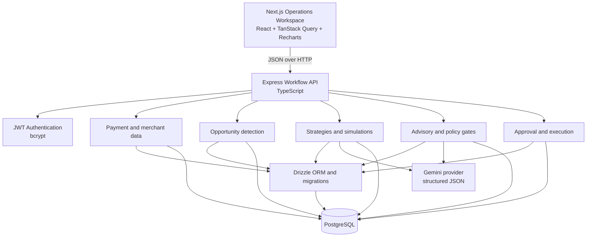

# PAYLAB

**An AI-powered payment operations and decision-execution platform that turns payment data into explainable, governed, and measurable actions.**


PAYLAB closes the operational loop from payment data to opportunity detection, strategy generation, simulation, advisory review, policy validation, merchant approval, execution, results, and audit trail. Revenue recovery is the primary use case, but the platform is designed around a broader problem: converting payment operations data into controlled decisions that can be evaluated and acted on.

> **Current scope:** PAYLAB works with seeded or application-managed payment data. Its execution flow is simulated and does not initiate real payment operations.

## What is PAYLAB?

Most payment systems stop at reporting: they show volume, success rates, and failures. PAYLAB is built for the next operational step. It identifies meaningful patterns, turns them into actionable strategies, tests expected impact, reviews risks, applies enforceable controls, and records what happened.

The platform separates analytical evidence, AI-assisted judgment, deterministic governance, and execution state. That makes each proposed action explainable and reviewable rather than an opaque recommendation or an isolated dashboard metric.

## Getting started with PAYLAB

New users begin by registering an account. Registration creates the user and their merchant workspace, then signs them in to the application. Before payment analysis can begin, the merchant chooses a data source from the **Data Source** page:

1. **Register** with a name, email, password, and merchant name.
2. **Open the data-source onboarding screen** from the workspace.
3. **Choose a source**:
   - **Use Demo Data** generates realistic customers, payments, and payment attempts for the authenticated merchant.
   - **Connect Razorpay** is displayed as a UI option, but provider OAuth and live ingestion are not implemented yet.
4. **Continue to the dashboard** after demo data generation completes.

## How the system works

### 1. Payment data and analysis

The API reads merchant-scoped `payments` and `payment_attempts` records. A newly registered merchant can generate application-managed demo records from the **Data Source** page; the generator creates related customers, payments, and attempts for that merchant only. Analytics can be viewed as an overview, by payment method, by failure dimension, or as time-based trends. Supported dimensions include payment method, hour, date, and device metadata.

This is the platform's evidence layer: it provides the operational context used by detection, strategy generation, and simulation.

### 2. Opportunity detection

`POST /api/opportunities/analyze` runs the current rule-based detector. Each opportunity stores its type, severity, priority, affected count, affected payment value, estimated opportunity value, confidence, and evidence.

Existing active opportunities of the same type are not duplicated. The detector uses minimum sample and lift thresholds so an isolated failure is not promoted as an opportunity.

### 3. Strategy generation

`POST /api/opportunities/:id/generate-strategy` sends the opportunity evidence, merchant context, and historical evidence to Gemini. The response must match a strict structured schema containing an objective, target segment, trigger, actions, expected impact, assumptions, risks, confidence, and reasoning.

The generated configuration is stored in `strategies`, with a version number and a strategy type derived from the opportunity type.

### 4. Simulation

`POST /api/strategies/:id/simulate` creates one simulation for a strategy. It calculates current success rate and revenue from the merchant's payment history, then applies a sampled recovery-rate assumption only to the opportunity's affected transactions and payment value.

The simulation records projected success rate, projected revenue, potential revenue recovery, confidence, assumptions, and risk level. It does not change payment records.

### 5. AI advisory

`POST /api/strategies/:id/advisory-review` sends the strategy, simulation output, opportunity, and opportunity evidence to Gemini. The response is normalized and validated before being persisted as an advisory review.

The advisory agent is consultative. Its system prompt explicitly prevents it from authorizing execution. A response of `APPROVE`, `MODIFY`, or `REJECT` becomes an advisory recommendation and risk assessment; it is not a substitute for policy enforcement or merchant approval.

### 6. Policy validation

`POST /api/strategies/:id/policy-check` evaluates the latest completed simulation and advisory review against the active merchant policy. The default policy includes:

| Rule | Default |
|---|---:|
| Maximum affected transaction percentage | 10% |
| Maximum revenue exposure percentage | 25% |
| Allowed payment methods | UPI, card, net banking |
| Allowed execution hours | 00:00–23:00 |
| Maximum daily execution amount | `100000.0000` |
| Minimum strategy confidence | 60 |
| Minimum simulation confidence | 60 |

The result stores evaluated values and failed rules. A passed check moves the strategy to `policy_approved`; a failed check moves it to `failed`. A strategy also requires an approved advisory recommendation.

### 7. Merchant approval

`POST /api/strategies/:id/approve` is available only after policy approval. The backend verifies the strategy state, completed simulation, advisory review, and passed policy result before recording the approving user and moving the strategy to `merchant_approved`.

### 8. Execution and results

`POST /api/strategies/:id/execute` creates an execution and immediately records a completed simulated result. The current implementation:

- does not call Razorpay or another payment provider;
- does not retry, refund, or mutate real payment state;
- stores `simulated: true` in audit metadata and execution details;
- calculates actual simulated recovery as 90% of the expected recovery.

Execution and result records are visible through the executions API and dashboard.

## System architecture

PAYLAB is split into a browser-based operations workspace and a workflow-oriented backend. The frontend presents the decision lifecycle; the backend owns merchant scoping, state transitions, persistence, AI orchestration, policy enforcement, execution recording, and auditability.



### Major backend modules

- `auth` — registration, login, current-user lookup, access tokens.
- `merchants` — merchant profile and merchant context.
- `payments` — paginated payment records, payment details, statistics.
- `analytics` — overview, payment-method, failure-dimension, and trend analytics.
- `opportunities` — deterministic detection, listing, details, and strategy generation entry point.
- `strategies` — strategy retrieval, simulation, advisory review, approval, and execution orchestration.
- `policies` — merchant policy configuration and deterministic policy evaluation.
- `executions` — execution history and details.
- `audit-logs` — immutable-style workflow event history exposed to the authenticated merchant.
- `ai` — Gemini provider, structured strategy generation, and advisory validation.

## Project structure

```text
.
├── backend/
│   ├── drizzle/                 # PostgreSQL migration SQL and metadata
│   ├── src/
│   │   ├── ai/                  # Gemini provider, strategy generator, advisory agent
│   │   ├── config/              # Environment parsing and logging
│   │   ├── db/                  # Drizzle client, schema, reset
│   │   ├── middleware/          # Authentication, rate limiting, logging, errors
│   │   ├── modules/
│   │   │   ├── analytics/
│   │   │   ├── audit-logs/
│   │   │   ├── auth/
│   │   │   ├── executions/
│   │   │   ├── merchants/
│   │   │   ├── opportunities/
│   │   │   ├── payments/
│   │   │   ├── policies/
│   │   │   ├── simulations/
│   │   │   └── strategies/
│   │   ├── app.ts                # Express app and route registration
│   │   └── server.ts             # HTTP server and graceful shutdown
│   ├── .env.example
│   └── package.json
├── frontend/
│   ├── src/
│   │   ├── app/                  # Next.js routes
│   │   ├── components/           # Dashboard, review, execution, and UI components
│   │   └── lib/                 # API clients and frontend utilities
│   ├── .env.example
│   └── package.json
└── README.md
```

## Environment variables

### Backend

Copy `backend/.env.example` to `backend/.env`. Values below are names and safe development defaults only; do not commit real secrets.

| Variable | Required | Purpose |
|---|---|---|
| `NODE_ENV` | No | `development`, `test`, or `production`; defaults to `development`. |
| `PORT` | No | Express port; defaults to `3000`. |
| `DATABASE_URL` | Yes | PostgreSQL connection string. |
| `JWT_SECRET` | Yes | At least 32 characters; used to sign access tokens. |
| `JWT_EXPIRES_IN` | No | JWT lifetime; defaults to `1h`. |
| `LOG_LEVEL` | No | Pino log level; defaults to `info`. |
| `CORS_ORIGIN` | No | Allowed frontend origin; defaults to `*`. |
| `DB_POOL_MAX` | No | PostgreSQL pool size; defaults to `10`. |
| `JSON_BODY_LIMIT` | No | Express JSON body limit; defaults to `1mb`. |
| `AUTH_RATE_LIMIT_WINDOW_MS` | No | Authentication rate-limit window; defaults to `900000`. |
| `AUTH_RATE_LIMIT_MAX` | No | Authentication requests per window; defaults to `20`. |
| `AI_RATE_LIMIT_WINDOW_MS` | No | AI endpoint rate-limit window; defaults to `900000`. |
| `AI_RATE_LIMIT_MAX` | No | AI requests per window; defaults to `10`. |
| `GEMINI_API_KEY` | For AI features | Google Gemini API key. |
| `GEMINI_MODEL` | No | Gemini model name; defaults to `gemini-3.6-flash`. |

### Frontend

Copy `frontend/.env.example` to `frontend/.env.local`:

```dotenv
NEXT_PUBLIC_API_URL=http://localhost:3000/api
```

Set this to the URL where the backend API is running. The backend defaults to port `3000`; use `http://localhost:8000/api` instead if you configure `PORT=8000`. The frontend stores the returned access token in browser `sessionStorage`.

## Local setup

### Prerequisites

- Node.js with npm.
- A running PostgreSQL instance and an empty `paylab` database.
- A Gemini API key if you want to use strategy generation and advisory review.

### Install and configure

```powershell
cd backend
npm install
Copy-Item .env.example .env

cd ..\frontend
npm install
Copy-Item .env.example .env.local
```

Set `DATABASE_URL` and a strong `JWT_SECRET` in `backend/.env`. Set `NEXT_PUBLIC_API_URL` in `frontend/.env.local` if the API is not at the configured default.

### Apply migrations

The reset command resets the PostgreSQL `public` and `drizzle` schemas.

```powershell
cd backend
npm run db:reset
```

Other database commands available in the backend:

```powershell
npm run db:generate
npm run db:migrate
npm run db:check
npm run db:studio
```

### Run the applications

In one terminal:

```powershell
cd backend
npm run dev
```

In a second terminal:

```powershell
cd frontend
npm run dev
```

The backend exposes health checks at `/health` and `/ready`. Open the frontend URL printed by Next.js, normally `http://localhost:3000`.

## Future improvements

These are not current capabilities; they are possible extensions:

- Add payment-provider ingestion, webhooks, idempotency, and reconciliation.
- Calibrate recovery assumptions from historical cohorts and measured experiment outcomes.
- Expand detection to issuer, error-code, geography, cohort, and provider patterns.
- Add backtesting, confidence intervals, experiment tracking, and strategy version comparison.
- Connect approved actions to a sandbox payment provider before considering controlled production integrations.
- Add granular role-based permissions, approval delegation, and stronger operational controls.
- Add background jobs for large datasets and scheduled analysis.
- Add automated API contract tests, end-to-end workflow tests, and deployment documentation.
